# P2PLoanPlatformFronter
****
***Project Discription*** *: The fronter of p2p loan platform*
***Language and templete*** *: Vue, Vuex, Element-ui*
****
## Prototype:

1.Not login:

    1.index.vue
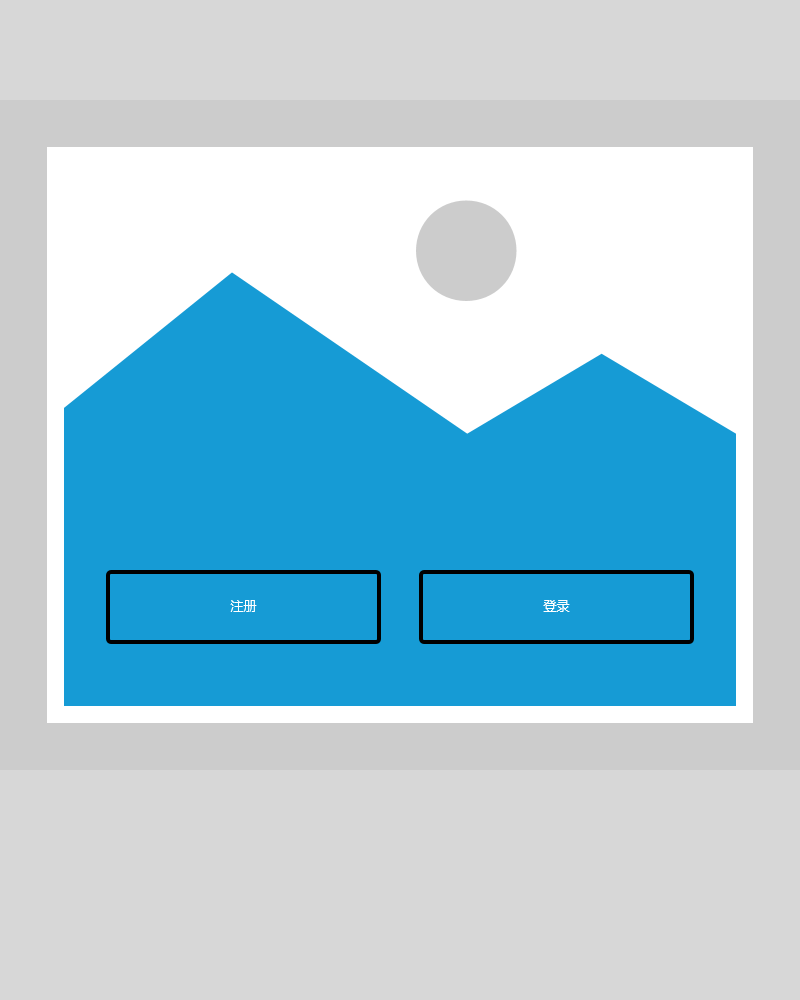
    2.login.vue
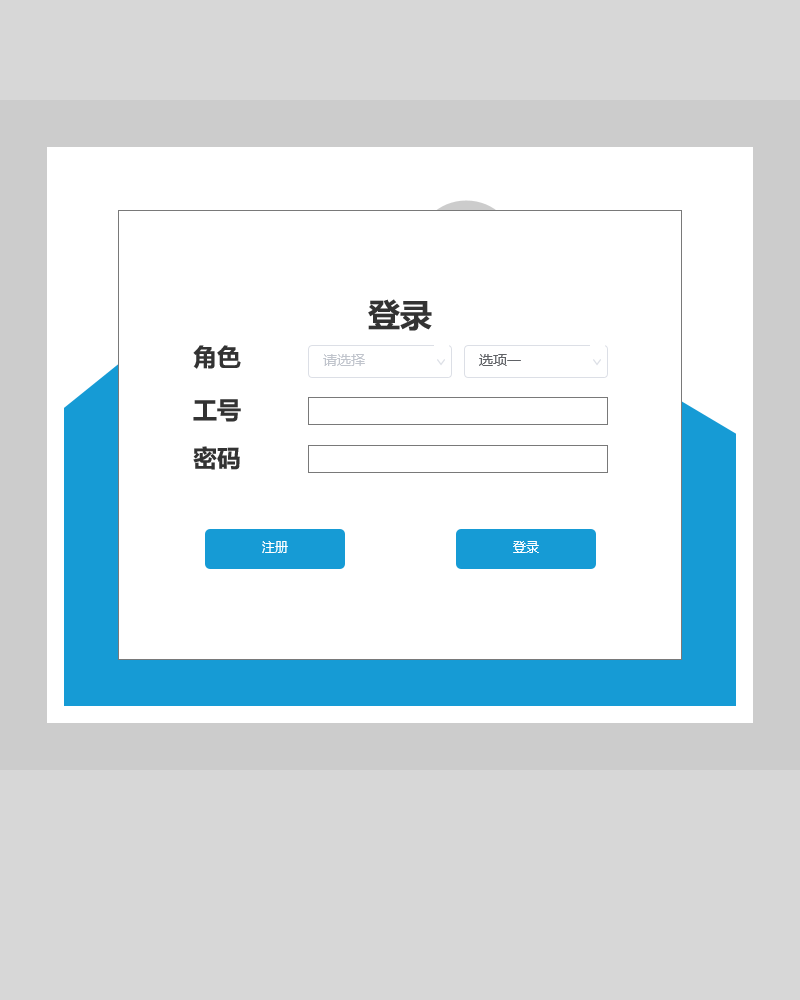
    3.registry.vue
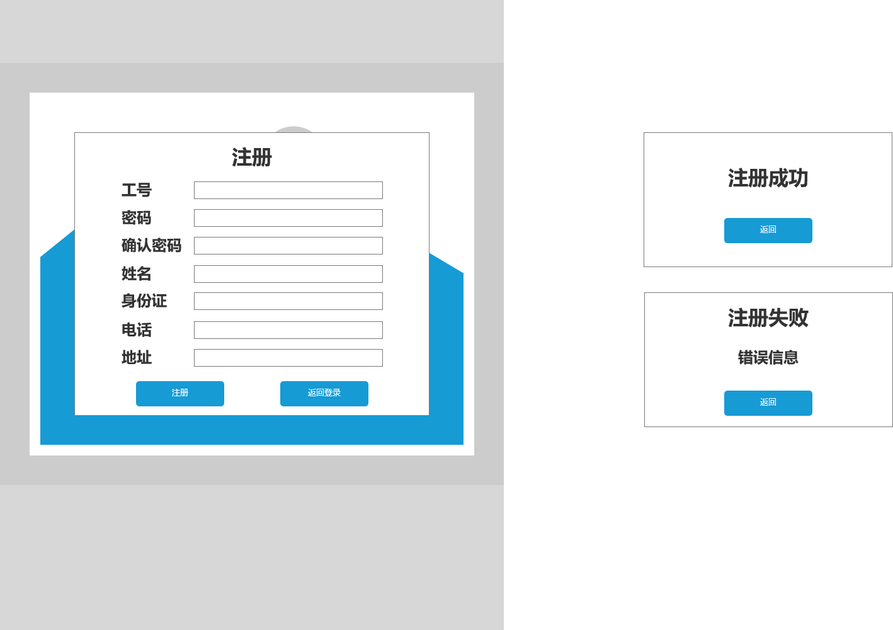

2.Login:

    1.home.vue
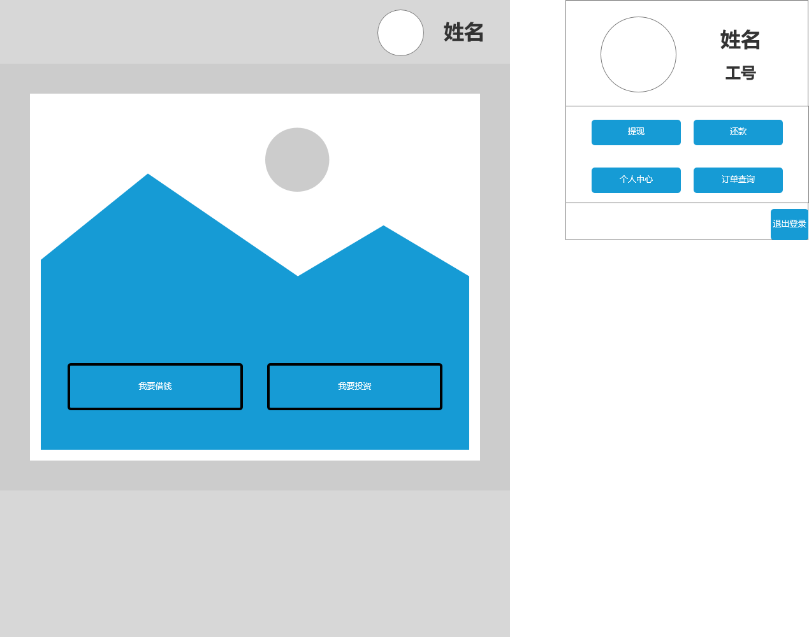
    2.investment.vue
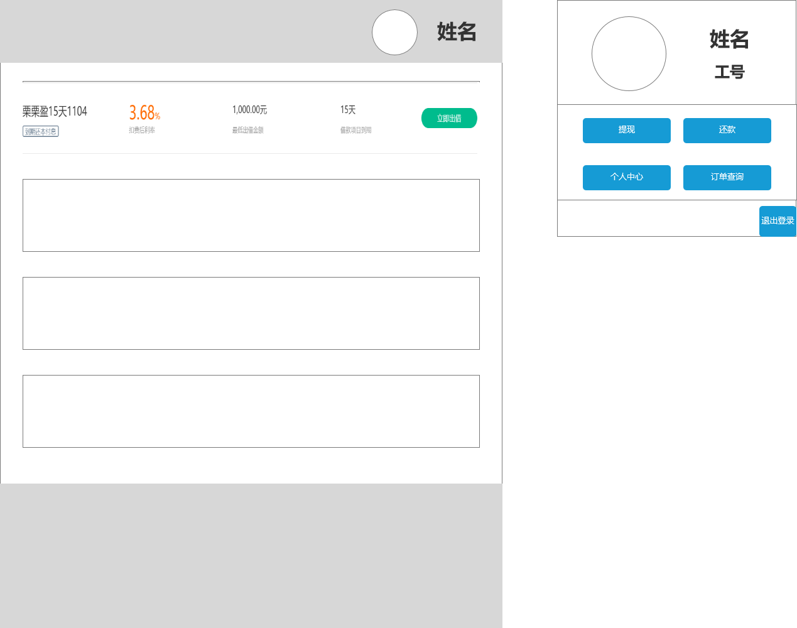
    3.investmentdetails
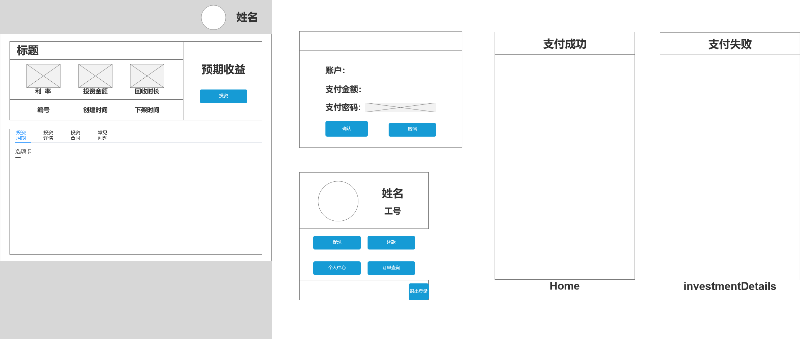
    4.investmentrecords
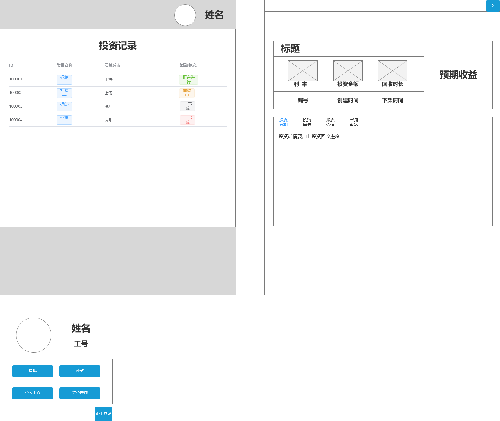
    5.credit.vue
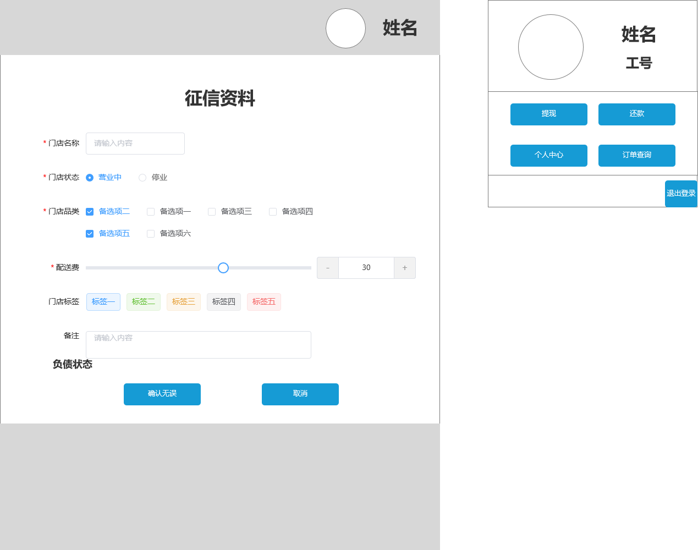
    6.loandetails.vue
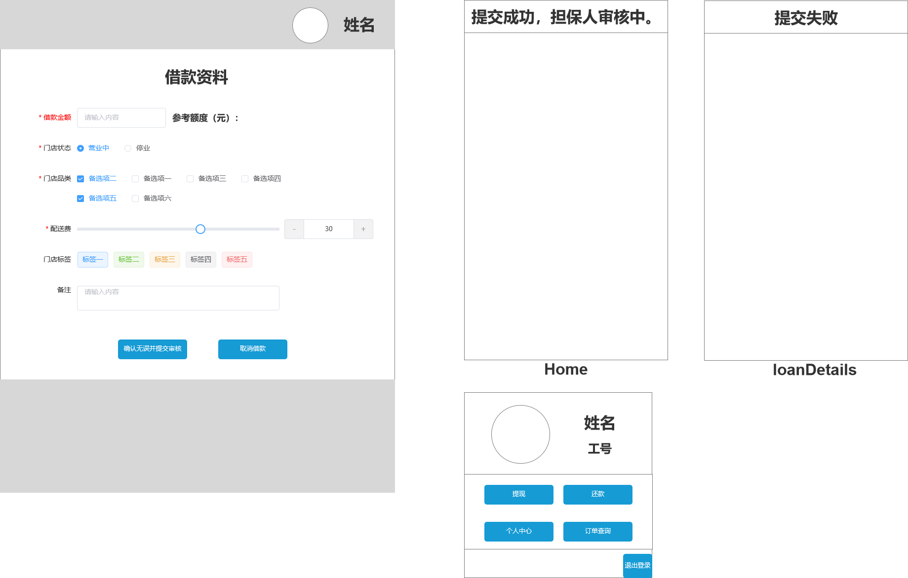
    7.loanrecords.vue
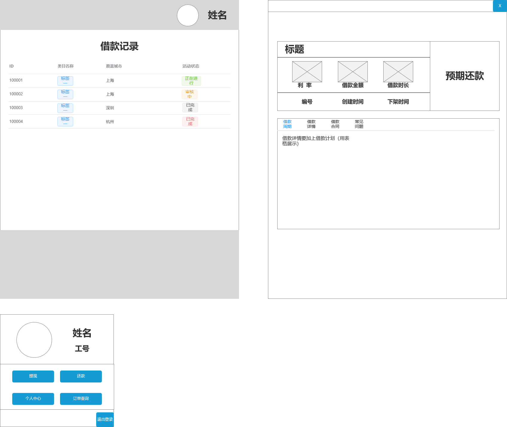
    8.letters.vue
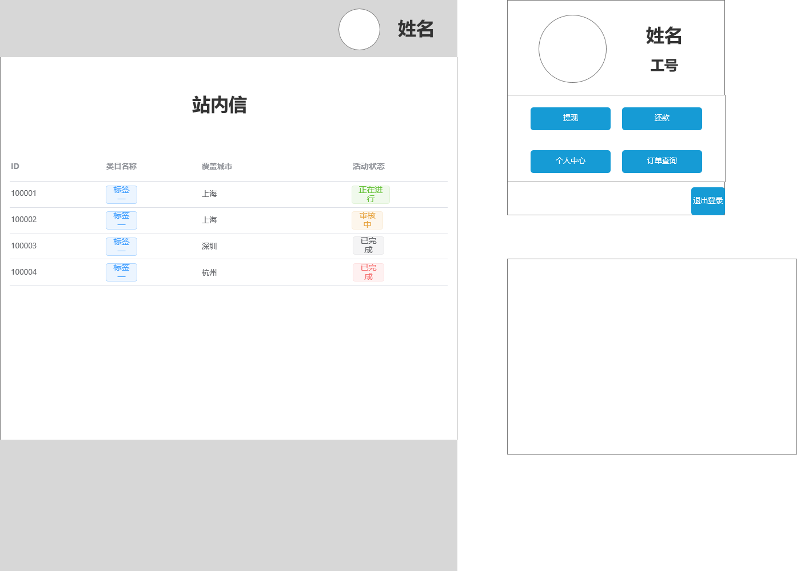

****
## TODO List:

***Use ~~delete~~ when finished a page completly***
****

1.Not login:

    1.index.vue
    version: 1.0
    TODO: 
    2.login.vue
    version:
    TODO: 
    3.registry.vue
    version:
    TODO:

2.Login:

    1.home.vue
    version: 1.0
    TODO: 
    2.investment.vue
    version:
    TODO:
    3.investmentdetails
    version:
    TODO:
    4.investmentrecords
    version:
    TODO:
    5.credit.vue
    version:
    TODO:
    6.loandetails.vue
    version:
    TODO:
    7.loanrecords.vue
    version:
    TODO:
    8.letters.vue
    version:1.0
    TODO: 

****
## Issues:
***Use ~~delete~~ when issue is fixed***
****

1.Not login:

    1.index.vue
        1.
    2.login.vue
        1.
    3.registry.vue
        1.

2.Login:

    1.home.vue
        1.
    2.investment.vue
        1.
    3.investmentdetails
        1.
    4.investmentrecords
        1.
    5.credit.vue
        1.
    6.loandetails.vue
        1.
    7.loanrecords.vue
        1.
    8.letters.vue
        1. 

## Backend Code
&emsp;&emsp;[Backend Project](https://github.com/Light-V/P2PLoanPlatform)，主要使用了springboot，具体详见后端文档。

## Relation Infomation
&emsp;&emsp;Mirroon's email: <mirroon@126.com>

